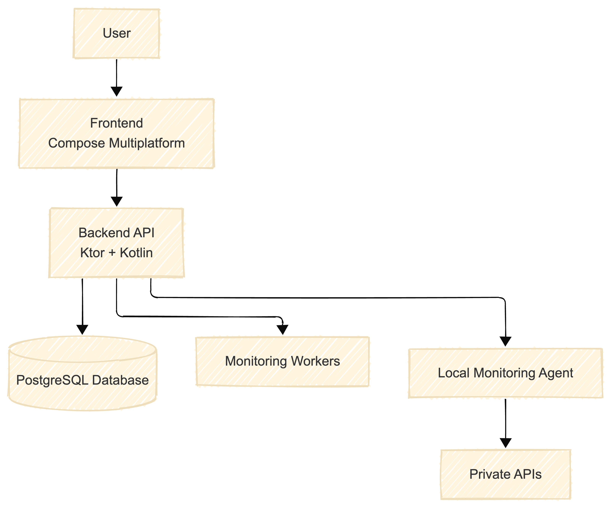

# System Architecture

The system is composed of the following main components:

- Client Application (Compose Multiplatform)
- Backend Service (Ktor + Kotlin)
- Monitoring Workers
- Local Monitoring Agent (future component)
- Data Storage (in-memory for now, PostgreSQL in future)

## Overview

Users interact with the client application, built using Compose Multiplatform, which communicates with the backend through a REST API implemented with Ktor.

The backend is responsible for:

- managing user accounts
- storing monitored endpoints (in-memory)
- receiving monitoring metrics
- computing aggregated metrics (e.g., uptime, latency)

Monitoring workers execute periodic HTTP checks on registered endpoints, collecting metrics such as latency and status codes. These metrics are then sent to the backend.

A local monitoring agent is planned for future implementation, allowing monitoring of private/internal APIs from within the user’s infrastructure.

## Notes

At this stage, the system is implemented using an **in-memory data store** to simplify development and enable fast prototyping.
A relational database (PostgreSQL) will be introduced in later stages of the project.

