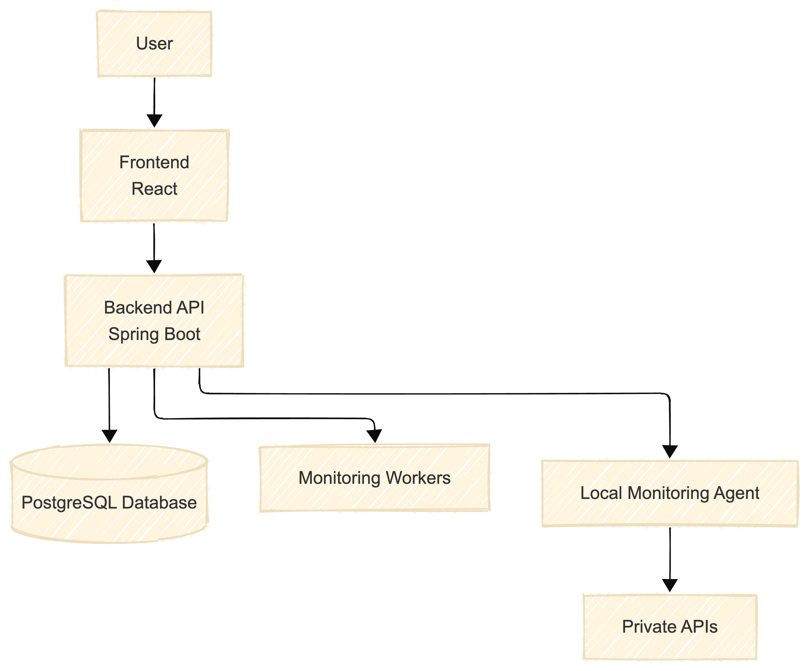

# Data Model

## users

| field | type |
|------|------|
id | uuid
email | text
password_hash | text
created_at | timestamp

## endpoints

| field | type |
|------|------|
id | uuid
user_id | uuid
url | text
http_method | text
monitor_interval_seconds | integer

## monitoring_results

| field | type |
|------|------|
id | uuid
endpoint_id | uuid
timestamp | timestamp
latency_ms | integer
status_code | integer
success | boolean
error_message | text
worker_id | text