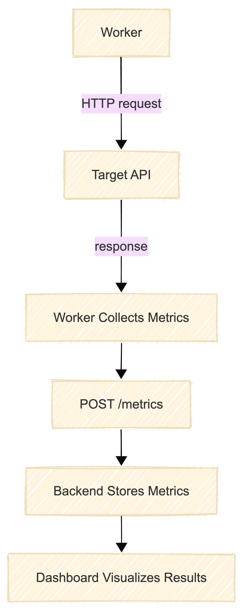

# Monitoring Workers

Monitoring workers are responsible for executing periodic checks on registered API endpoints.

  

#### Each worker:

1. Fetches monitoring jobs from the backend
2. Executes HTTP requests to the target API
3. Measures latency and collects response data
4. Sends metrics back to the backend

Workers operate asynchronously and independently from the main backend service.